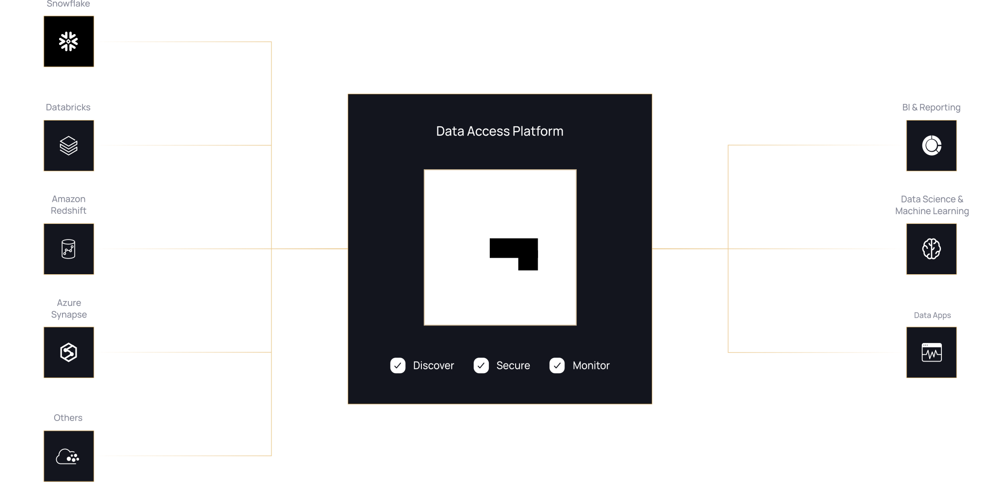
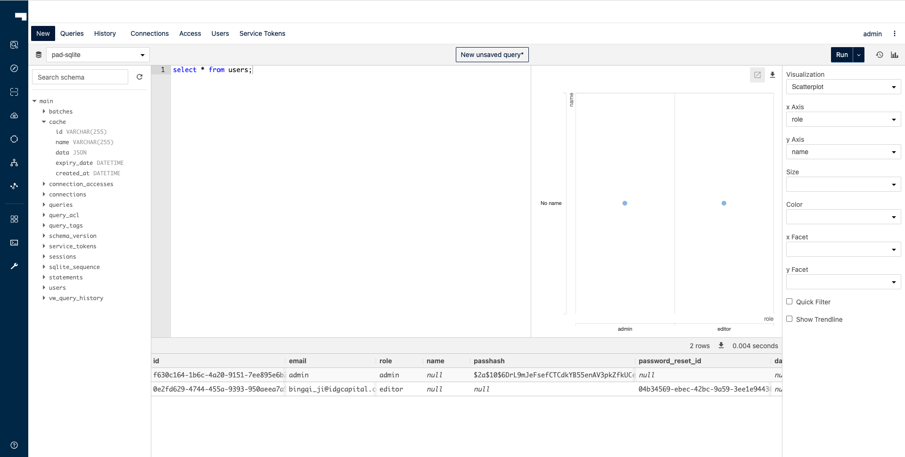
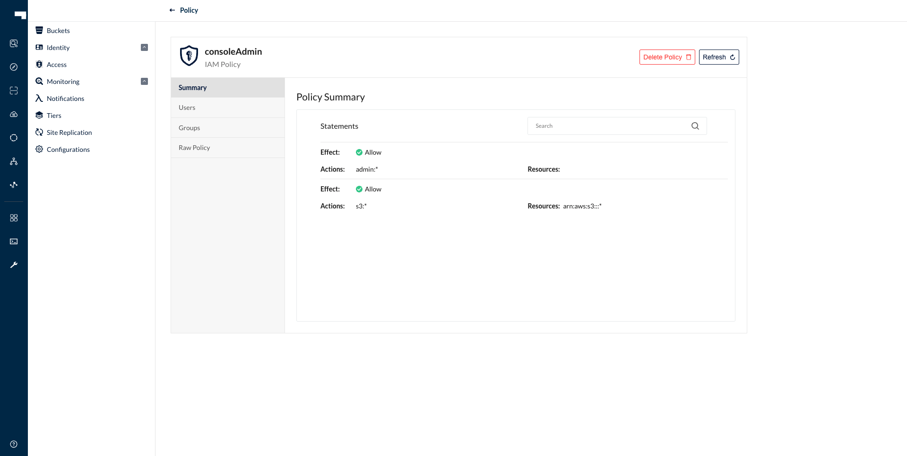

<div align="right">
    
    <br />
</div>
<div align="center">
   
   <br/>
   <small>Management UI for GuinsooLab</small>
</div>


# GuinsooLab Console

 

A graphical user interface for [GuinsooLab](https://guinsoolab.github.io/glab/).



## Install

### Binary Releases

| OS      | ARCH    | Binary                                                         |
|:-------:|:-------:|:-----------------------------------------------------:|
| Linux   | amd64   | [linux-amd64](https://ciusji.gitbook.io/guinsoolab/)         |
| Linux   | arm64   | [linux-arm64](https://ciusji.gitbook.io/guinsoolab/)         |
| Linux   | ppc64le | [linux-ppc64le](https://ciusji.gitbook.io/guinsoolab/)     |
| Linux   | s390x   | [linux-s390x](https://ciusji.gitbook.io/guinsoolab/)         |
| Apple   | amd64   | [darwin-amd64](https://ciusji.gitbook.io/guinsoolab/)       |
| Windows | amd64   | [windows-amd64](https://ciusji.gitbook.io/guinsoolab/) |

You can also verify the binary with [minisign](https://jedisct1.github.io/minisign/) by downloading the corresponding `.minisig` signature file. Then run:
```
minisign -Vm console-<OS>-<ARCH> -P RWTx5Zr1tiHQLwG9keckT0c45M3AGeHD6IvimQHpyRywVWGbP1aVSGav
```

### Docker

Pull the latest release via:
```
docker pull guinsoolab/console
```

### Build from source
> You will need a working Go environment. Therefore, please follow [How to install Go](https://golang.org/doc/install).
> Minimum version required is go1.17

```
git clone git@github.com:GuinsooLab/console.git
sh cross-compile.sh
./console server
cd portal-ui
yarn start
```

## Setup

All `console` needs is a GuinsooLab user with admin privileges and URL pointing to your GuinsooLab deployment.

> Note: We don't recommend using GuinsooLab's Operator Credentials

### 1. Create a user `console` using `mc`

```bash
mc admin user add mystore/
Enter Access Key: admin
Enter Secret Key: xxxxxxxx
```

### 2. Create a policy for `console` with admin access to all resources (for testing)

```sh
cat > admin.json << EOF
{
	"Version": "2012-10-17",
	"Statement": [{
			"Action": [
				"admin:*"
			],
			"Effect": "Allow",
			"Sid": ""
		},
		{
			"Action": [
                "s3:*"
			],
			"Effect": "Allow",
			"Resource": [
				"arn:aws:s3:::*"
			],
			"Sid": ""
		}
	]
}
EOF
```

```sh
mc admin policy add mystore/ consoleAdmin admin.json
```

### 3. Set the policy for the new `console` user

```sh
mc admin policy set myGuinsooLab ConsoleAdmin user=console
```

> NOTE: Additionally, you can create policies to limit the privileges for other `console` users, for example, if you want the user to only have access to dashboard, buckets, notifications and watch page, the policy should look like this:

```json
{
	"Version": "2012-10-17",
	"Statement": [{
			"Action": [
				"admin:ServerInfo"
			],
			"Effect": "Allow",
			"Sid": ""
		},
		{
			"Action": [
				"s3:ListenBucketNotification",
				"s3:PutBucketNotification",
				"s3:GetBucketNotification",
				"s3:ListMultipartUploadParts",
				"s3:ListBucketMultipartUploads",
				"s3:ListBucket",
				"s3:HeadBucket",
				"s3:GetObject",
				"s3:GetBucketLocation",
				"s3:AbortMultipartUpload",
				"s3:CreateBucket",
				"s3:PutObject",
				"s3:DeleteObject",
				"s3:DeleteBucket",
				"s3:PutBucketPolicy",
				"s3:DeleteBucketPolicy",
				"s3:GetBucketPolicy"
			],
			"Effect": "Allow",
			"Resource": [
				"arn:aws:s3:::*"
			],
			"Sid": ""
		}
	]
}
```

## Start Console service

Before running console service, following environment settings must be supplied
```sh
# Salt to encrypt JWT payload
export CONSOLE_PBKDF_PASSPHRASE=SECRET

# Required to encrypt JWT payload
export CONSOLE_PBKDF_SALT=SECRET

# AnnaStore Endpoint
export CONSOLE_ANNASTORE_SERVER=http://localhost:9000
```

Now start the console service.
```
./console server
2021-01-19 02:36:08.893735 I | 2021/01/19 02:36:08 server.go:129: Serving console at http://localhost:9090
```

By default `console` runs on port `9090` this can be changed with `--port` of your choice.

## Start Console service with TLS

Copy your `public.crt` and `private.key` to `~/.console/certs`, then:

```sh
./console server
2021-01-19 02:36:08.893735 I | 2021/01/19 02:36:08 server.go:129: Serving console at http://[::]:9090
2021-01-19 02:36:08.893735 I | 2021/01/19 02:36:08 server.go:129: Serving console at https://[::]:9443
```

For advanced users, `console` has support for multiple certificates to service clients through multiple domains.

Following tree structure is expected for supporting multiple domains:
```sh
 certs/
  │
  ├─ public.crt
  ├─ private.key
  │
  ├─ example.com/
  │   │
  │   ├─ public.crt
  │   └─ private.key
  └─ foobar.org/
     │
     ├─ public.crt
     └─ private.key
  ...

```

## Connect Console to An AnnaStore using TLS and a self-signed certificate

Copy the AnnaStore `ca.crt` under `~/.console/certs/CAs`, then:

```sh
export CONSOLE_GUINSOOLAB_SERVER=https://localhost:9000
./console server
```

You can verify that the apis work by doing the request on `localhost:9090/api/v1/...`

## Screenshots & Gifs

### Console SQL pad



### Console AnnaStore



And others coming.

## Contribute to console Project
Please follow console [Contributor's Guide](https://ciusji.gitbook.io/guinsoolab/appendix/contribution)


